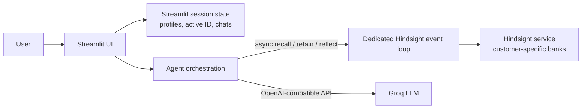

# Memory-Powered Customer Support Agent

A Streamlit customer-support assistant that maintains a separate Hindsight memory bank for each customer and uses Groq-hosted language models to answer questions and extract durable support context.

## Contents

- [Capabilities](#capabilities)
- [System Architecture](#system-architecture)
- [Customer Isolation and Data Lifecycle](#customer-isolation-and-data-lifecycle)
- [Conversation and Memory Flow](#conversation-and-memory-flow)
- [Technology and Dependencies](#technology-and-dependencies)
- [Configuration](#configuration)
- [Local Development](#local-development)
- [Operational and Production Considerations](#operational-and-production-considerations)
- [Manual Isolation Test](#manual-isolation-test)
- [Repository Layout](#repository-layout)

## Capabilities

- Create multiple customer profiles and switch between them in the sidebar.
- Assign each profile a UUID-based customer ID and a matching, unique Hindsight bank ID.
- Restore each customer's conversation while switching profiles within the same Streamlit session.
- Recall up to three relevant memories from the selected customer's bank before generating a response.
- Extract a short, factual support note from each completed exchange and retain it in that customer's bank.
- Reflect over the selected customer's memory bank and show a synthesized customer summary.
- Clear the selected customer's chat without deleting their Hindsight memories.
- Display the memories used for an assistant response and the note retained after an exchange.
- Fall back between two configured Groq models if a model request fails.

## System Architecture



### Components

| Component | Responsibility |
| --- | --- |
| `app.py` | Streamlit interface, profile registry, active-profile selection, chat rendering, and per-session conversation state. |
| `agent.py` | Hindsight bank ID derivation, memory operations, conversation orchestration, and Groq requests. |
| Hindsight | Remote bank creation and long-term customer memory storage, retrieval, and reflection. |
| Groq | Assistant response generation and extraction of concise memory notes through its OpenAI-compatible API. |

Hindsight SDK calls use the asynchronous SDK methods (`acreate_bank`, `arecall`, `aretain`, and `areflect`). They run on one dedicated, persistent background event loop. This keeps the SDK's asynchronous HTTP client on the same loop across Streamlit reruns and avoids reusing it from a closed or unrelated event loop.

## Customer Isolation and Data Lifecycle

### Identity and bank mapping

When a profile is created, the application generates an ID in this form:

```text
customer-<uuid hex>
```

That profile ID is also its Hindsight bank ID. Every memory operation receives the selected profile's ID; the application does not use a shared customer bank. Creating another profile creates a new ID and bank, and does not replace or delete existing profiles or banks.

### Streamlit session state

The application stores these values in `st.session_state`:

| Key | Contents |
| --- | --- |
| `customer_profiles` | Map from customer ID to the profile record (ID, name, and profile fields). |
| `active_profile_id` | ID selected in the customer selector. |
| `chats` | Map from customer ID to that customer's ordered conversation turns. |
| `show_create_form` | UI state for the profile creation form. |

The active profile determines both the transcript rendered by the UI and the customer passed to recall, reply generation, retain, and reflect operations. Switching profiles restores the corresponding chat and selects that profile's Hindsight bank.

### Persistence boundaries

Hindsight memories are stored by the configured Hindsight service. Profile records and chats are currently held only in Streamlit session state; they are not written to a durable application database. They can be lost when the Streamlit session expires or the application restarts. Because the profile-to-bank mapping is session-scoped, restarting the application can also make previously created Hindsight banks undiscoverable from the UI.

`Clear this chat` removes the active customer's transcript from the current session only. It does not clear or delete that customer's Hindsight bank. Creating a new profile also does not delete any existing bank.

## Conversation and Memory Flow

1. The user selects or creates a customer. Profile creation initializes an empty chat and requests creation of a Hindsight bank for its unique ID.
2. When a message is submitted, the UI calls Hindsight recall for the selected customer if **Use Hindsight memory** is enabled. The result is limited to the three most relevant returned memories.
3. The agent sends the selected customer's name, relevant memories (or an explicit no-history context), and recent chat turns to Groq for a concise response.
4. The agent makes a second Groq request to extract one factual support note of at most 45 words from the exchange.
5. That note is retained in the selected customer's Hindsight bank. The conversation turn and saved-note indicator are kept in the selected customer's session-state chat.
6. The **What the AI remembers** action calls Hindsight reflect against the selected customer's bank and displays its synthesized response.

The **Use Hindsight memory** toggle controls recall context supplied to response generation. It does not disable memory retention: successful exchanges still pass through note extraction and retain. Configure the app accordingly if an interaction must not be stored.

## Technology and Dependencies

- Python
- Streamlit `>=1.35`
- `hindsight-client >=0.10.1,<0.11`
- OpenAI Python SDK `>=1.30` (used with Groq's OpenAI-compatible endpoint)
- `python-dotenv >=1.0`
- Hindsight service, local or hosted
- Groq API access to the configured models

The primary Groq model is `openai/gpt-oss-120b`; `qwen/qwen3-32b` is attempted as a fallback if the primary request fails. Update `MODELS` in `agent.py` to change this order.

## Configuration

Create a local `.env` file in the repository root:

```dotenv
GROQ_API_KEY=replace-with-your-groq-api-key
HINDSIGHT_URL=https://your-hindsight-service
HINDSIGHT_API_KEY=replace-with-your-hindsight-api-key
```

`GROQ_API_KEY` is required when a model request is made. `HINDSIGHT_URL` defaults to `http://localhost:8888` if omitted. `HINDSIGHT_API_KEY` is optional for unauthenticated Hindsight deployments and should be configured for authenticated services.

Do not commit `.env` or place credentials in source control. The repository's `.gitignore` excludes `.env` and `.env.*` files.

## Local Development

### Windows PowerShell

```powershell
py -m venv .venv
.\.venv\Scripts\Activate.ps1
python -m pip install --upgrade pip
python -m pip install -r requirements.txt
streamlit run app.py
```

### macOS or Linux

```bash
python3 -m venv .venv
source .venv/bin/activate
python -m pip install --upgrade pip
python -m pip install -r requirements.txt
streamlit run app.py
```

Configure the required service URLs and credentials before sending a message. The Hindsight endpoint must be reachable from the application host.

## Operational and Production Considerations

This repository is a functional prototype, not a complete multi-user production service. Before deploying for real customer data:

- Add authentication and authorization; the current profile selector is not an identity or access-control boundary.
- Persist customer records and profile-to-bank mappings in a durable database. Persist chats separately if transcript recovery is required.
- Define customer deletion and retention policies, including deletion of associated Hindsight banks through the supported SDK/API. There is no bank-deletion control in the current UI.
- Protect service credentials with the deployment platform's secret manager, and use TLS for remote service connections.
- Establish logging, monitoring, request timeouts, backup, and recovery procedures without recording secrets or unnecessary customer content.
- Review privacy, consent, data-residency, and retention requirements before sending conversation content to Groq or storing notes in Hindsight.
- Consider multi-process and multi-replica behavior: in-memory Streamlit session state is not a shared or durable profile store.

The application sends the customer message and generated reply to Groq for memory-note extraction. The resulting note is then sent to Hindsight. Avoid submitting sensitive data unless the service configuration and applicable data policies permit it.

## Manual Isolation Test

Use separate profiles and ask the same recall question to confirm bank isolation:

1. Create **Hari** and send: `I use an Android phone.` Confirm a memory note is saved.
2. Create **Rahul** and ask: `What phone do I use?` Rahul should not receive Hari's Android memory.
3. Tell Rahul: `I use an iPhone.` Confirm a memory note is saved.
4. Create **Priya** and ask the same question. Priya should not receive either device memory.
5. Switch back to Hari and ask the question. Hari should recall Android.
6. Switch to Rahul and ask the question. Rahul should recall iPhone.
7. Switch to Priya and ask the question again. Priya should remain without either phone fact.

## Repository Layout

```text
.
|-- agent.py          # Hindsight operations, event-loop handling, and Groq integration
|-- app.py            # Streamlit UI and per-session customer/chat state
|-- requirements.txt  # Runtime dependencies
|-- README.md         # Project and operational documentation
`-- .env              # Local credentials; ignored by Git
```